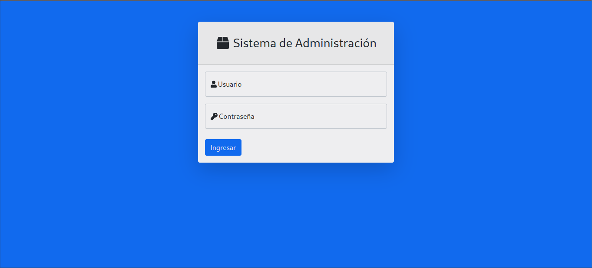
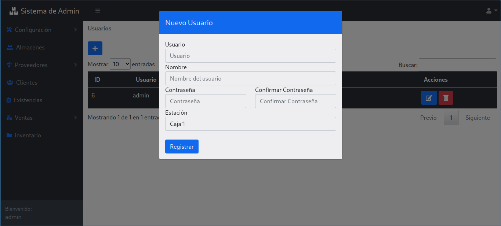
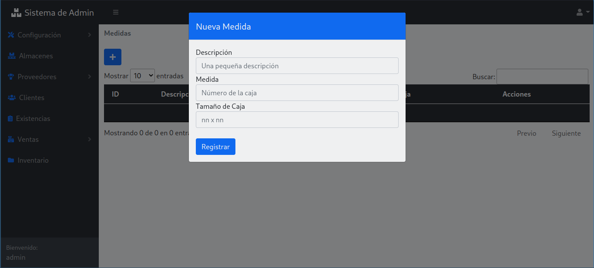
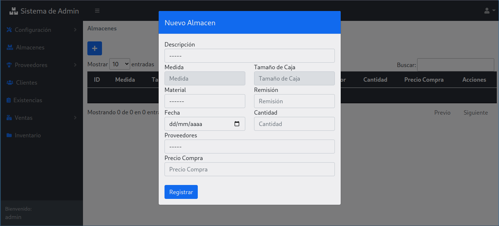
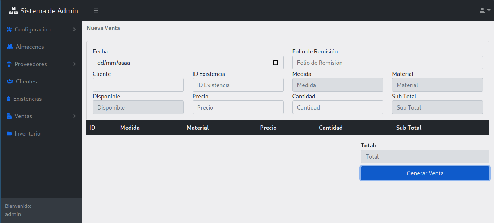
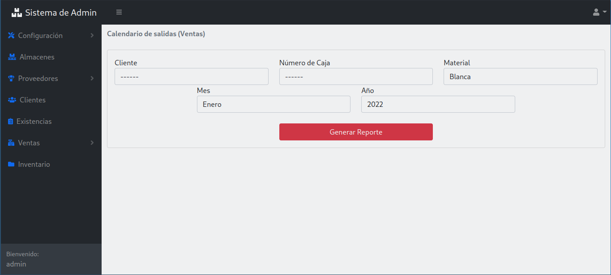

<h1>Sistema de administración de inventario escrito en PHP</h1>

<h2>Tecnologías usadas:</h2>

<ul>
<li> PHP </li>
<li> JavaScript </li>
<li> HTML </li>
<li> CSS </li>
<li> Bootstrap </li>
</ul>

<h2>Diseño:</h2>

<ul>
<li>MVC</li>
</ul>

<h2>Bases de datos:</h2>
<ul>
<li>MySQL (MariaDB) usada con XAMPP</li>
</ul>

<h2>Capturas de pantalla</h2>

<h3>Login:</h3>

<h3> Agregado de usuarios </h3>

<h3> Agregado de medidas </h3>

<h3> Agregado de almacenes </h3>

<h3> Agregado de ventas </h3>

<h3> Calendario (Ventas) </h3>

